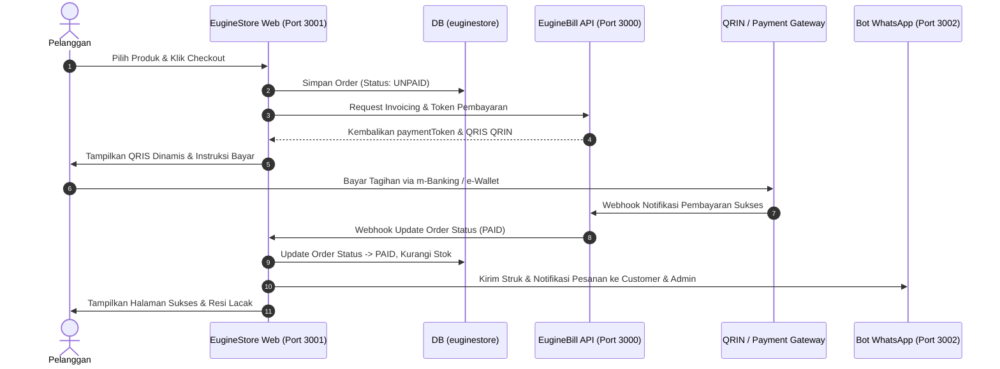

# EugineStore — Technical Architecture & Data Flow

Dokumen ini merinci rancangan teknis, alur transaksi, skema data, dan kontrak API untuk platform **EugineStore**.

---

## 1. Data Flow & Transaction Lifecycle



---

## 2. Database Schema Blueprint (Prisma ORM)

```prisma
model StoreProduct {
  id            String          @id @default(cuid())
  slug          String          @unique
  name          String          @db.VarChar(255)
  category      String          @db.VarChar(100) // HARDWARE, IT_SERVICE, CCTV, DIGITAL_SOFTWARE, PC_SERVER
  description   String          @db.Text
  price         Int
  discountPrice Int?
  stock         Int             @default(0)
  soldCount     Int             @default(0)
  images        Json            // Array of image URLs
  specifications Json?          // Key-value pairs
  tokopediaUrl  String?         @db.Text
  shopeeUrl     String?         @db.Text
  isFeatured    Boolean         @default(false)
  isActive      Boolean         @default(true)
  createdAt     DateTime        @default(now())
  updatedAt     DateTime        @updatedAt
  orderItems    StoreOrderItem[]

  @@index([category])
  @@index([isActive])
  @@map("store_products")
}

model StoreOrder {
  id              String           @id @default(cuid())
  orderNumber     String           @unique // e.g. EMG-ORD-202610-001
  customerName    String           @db.VarChar(191)
  customerPhone   String           @db.VarChar(50)
  customerEmail   String?          @db.VarChar(191)
  shippingAddress String?          @db.Text
  courier         String?          @db.VarChar(100)
  trackingNumber  String?          @db.VarChar(100)
  totalAmount     Int
  shippingCost    Int              @default(0)
  paymentMethod   String           @db.VarChar(50) // QRIS_QRIN, VA_BCA, MANUAL_TRANSFER, COD, WA_CONSULT
  paymentToken    String?          @db.VarChar(191)
  status          StoreOrderStatus @default(UNPAID)
  notes           String?          @db.Text
  createdAt       DateTime         @default(now())
  updatedAt       DateTime         @updatedAt
  items           StoreOrderItem[]

  @@index([orderNumber])
  @@index([customerPhone])
  @@index([status])
  @@map("store_orders")
}

model StoreOrderItem {
  id        String       @id @default(cuid())
  orderId   String
  productId String
  quantity  Int          @default(1)
  price     Int
  order     StoreOrder   @relation(fields: [orderId], references: [id], onDelete: Cascade)
  product   StoreProduct @relation(fields: [productId], references: [id])

  @@map("store_order_items")
}

enum StoreOrderStatus {
  UNPAID
  PAID
  PROCESSING
  SHIPPED
  COMPLETED
  CANCELLED
}
```
